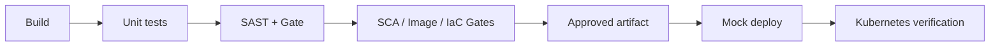

# AppSec / SecOps Case Study

[](https://github.com/naolia1211/appsec-secops-case-study/actions/workflows/ci.yml?query=branch%3Amain)

This repository contains an AppSec/SecOps case study built around one Flask
application and one delivery flow from source code to Kubernetes.

The implementation covers:

- **Task 1 - Secure CI/CD:** build, unit testing, Semgrep SAST and release gate.
- **Task 2 - Kubernetes Hardening:** insecure/hardened manifests, RBAC,
  NetworkPolicy, Pod Security Admission and runtime verification.
- **Task 3 - SCA / Container / IaC Security:** dependency, container image and
  configuration scanning with blocking policy gates.

## Delivery flow

The application image is built once and passed through the security stages
before deployment.



A blocking finding, scanner failure, invalid report or failed policy evaluation
prevents the dependent release jobs from continuing.

## Requirements

Local execution requires:

- Docker Engine with Linux container support
- Docker Compose v2
- Git Bash or a Linux shell
- approximately 4 GB of available memory for the Kubernetes lab

Python is not required on the host for the main Docker-based demo.

## Quick start

Run the full local CI/security flow from the repository root:

```bash
bash scripts/demo.sh
```

This builds the application image, runs tests and security checks, and starts
the application only if the required gates pass.

The API is exposed on:

```text
http://localhost:18080
```

Example:

```bash
curl --fail http://localhost:18080/health
```

Expected response:

```json
{"status":"ok"}
```

Stop the local application with:

```bash
docker compose down
```

## Pipeline

The GitHub Actions workflow is defined in:

```text
.github/workflows/ci.yml
```

The main jobs are:

| Job | Purpose |
| --- | --- |
| Build | Build `appsec-demo:<commit SHA>` and publish the image archive |
| Test | Run application and security-control unit tests |
| Security | Run Semgrep and evaluate the SAST release policy |
| Task 3 | Run SCA, container and IaC security gates |
| Deploy mock | Load the approved image and verify application responses |
| Kubernetes hardening | Deploy the approved image to the local K3s lab and run runtime checks |

The same application image is promoted through the pipeline instead of being
rebuilt after the security checks.

## Task 1 - Secure CI/CD and SAST

Task 1 uses Semgrep to scan Python source code in `app/` and `scripts/`.

The scan uses the local rules in:

```text
.semgrep.yml
```

together with Semgrep's `p/python` ruleset.

The SAST result is evaluated by:

```text
scripts/security_gate.py
```

Current policy:

| SAST result | Decision |
| --- | --- |
| One or more ERROR findings | BLOCK |
| WARNING / INFO only | PASS; findings remain in the report |
| No findings | PASS |
| Missing/invalid report, scanner error or unknown severity | BLOCK |

The gate is fail-closed when the scan result cannot be evaluated reliably.

### Task 1 evidence

Historical SAST BLOCK:

https://github.com/naolia1211/appsec-secops-case-study/actions/runs/35487650775

Historical SAST PASS:

https://github.com/naolia1211/appsec-secops-case-study/actions/runs/35487648462

The intentional SAST fixture is kept on the demo branch and is not part of
`main`.

Detailed validation is documented in:

```text
docs/ci-evidence.md
docs/validation.md
```

## Task 2 - Kubernetes Deploy and Hardening

Task 2 deploys the approved image to a local k3d/K3s environment.

Two manifest sets are kept for comparison:

```text
k8s/insecure/
k8s/hardened/
```

The insecure baseline intentionally contains security misconfigurations.
Trivy config scanning identifies 19 findings in the baseline, including
2 CRITICAL and 3 HIGH findings.

The hardened workload applies:

- non-root execution with a fixed UID;
- privilege escalation disabled;
- Linux capabilities dropped;
- read-only root filesystem;
- seccomp;
- CPU and memory requests/limits;
- ServiceAccount token automount disabled;
- least-privilege Kubernetes API access;
- default-deny NetworkPolicy with explicit required flows;
- Restricted Pod Security Admission.

The local verification suite performs 33 runtime checks covering workload
identity, filesystem restrictions, RBAC, NetworkPolicy and admission control.

### Run the Kubernetes lab

Task 1 must run first because the Kubernetes lab consumes the approved image
record produced by the security flow:

```bash
bash scripts/demo.sh
```

Then run:

```bash
docker compose -f docker-compose.k8s.yml build lab
docker compose -f docker-compose.k8s.yml run --rm lab all
```

Clean up with:

```bash
docker compose -f docker-compose.k8s.yml run --rm lab destroy
```

See `docs/task2.md` for the before/after analysis, NetworkPolicy rollout
strategy and runtime verification details.

## Task 3 - SCA, Container and IaC Security

Task 3 covers all three optional security areas:

| Area | Tool | Purpose |
| --- | --- | --- |
| SCA | pip-audit | Detect vulnerable Python dependencies |
| Container | Trivy | Detect vulnerable packages in the approved image |
| IaC | Trivy | Detect Dockerfile and Kubernetes misconfiguration |

The release gates are implemented by:

```text
scripts/sca_gate.py
scripts/container_gate.py
scripts/iac_gate.py
```

The full local pipeline already includes Task 3:

```bash
bash scripts/demo.sh
```

To rerun only Task 3 after a successful Task 1 approval:

```bash
bash scripts/demo_task3.sh
```

Missing or malformed reports are rejected. The container gate also verifies
that the scanned image identity matches the approved application artifact.

### Findings and remediation

Three remediation cases are demonstrated.

**Dependency**

`pip-audit` identified Flask 3.1.2 as affected by
`PYSEC-2026-2151 / CVE-2026-27205`.

The dependency was updated to Flask 3.1.3 and rescanned.

**Python packages in the runtime image**

Trivy identified six findings associated with `pip` in the runtime image.

The Dockerfile was changed to a multi-stage build and unnecessary runtime
packages such as `pip` and `setuptools` were removed from the final image.

**Base image**

The previous Debian-based runtime image contained 152 OS-package findings,
including 44 HIGH and 2 UNKNOWN findings.

The runtime was changed to the official Python 3.12 Alpine image, pinned by
digest. The scanned runtime OS is Alpine 3.24.2.

The remediated image has zero OS and Python-package findings in the current
evidence set. SCA and IaC gates also pass without risk exceptions.

### Task 3 evidence

Historical BLOCK:

https://github.com/naolia1211/appsec-secops-case-study/actions/runs/35607540442

Remediated PASS:

https://github.com/naolia1211/appsec-secops-case-study/actions/runs/35608731394

The BLOCK run stops release because the previous image exceeds the container
risk policy. In the remediated run, SCA, container and IaC gates pass and the
release continues through mock deployment and Kubernetes verification.

### Reproduce the dependency BLOCK

The dependency fixture is maintained on a separate branch:

```bash
git switch codex/demo-dependency-block
bash scripts/demo.sh; echo $?
git switch main
```

The branch restores the vulnerable Flask 3.1.2 dependency used before
remediation. The SCA gate is expected to block the release path.

The fixture branch is retained only for negative testing and must not be
merged into `main`.

See `docs/task3.md` for the detailed scan evidence and remediation analysis.

## Mock deployment

`Deploy mock` is an ephemeral CI validation step, not a production deployment.

The job loads the approved Docker image, starts a temporary container, verifies
the application endpoints and collects the test result. The container is
removed when the job finishes.

The purpose is to verify that the artifact which passed the security gates can
start successfully before Kubernetes verification. It does not model production
availability, traffic management or orchestration.

## Repository structure

```text
.github/workflows/     GitHub Actions pipeline
app/                   Flask application
docs/                  Task documentation and validation evidence
k8s/                   Insecure and hardened Kubernetes manifests
reports/               Security scan evidence
scripts/               Scanners, policy gates and demo automation
tests/                 Application and security-control tests
Dockerfile             Application image
docker-compose.yml     Local application/security environment
docker-compose.k8s.yml Local Kubernetes lab
```

## Scope and limitations

This repository is a case-study security lab rather than a production
deployment platform.

Current limitations include:

- branch protection and independent release approval are not configured;
- transitive dependencies are not fully locked;
- registry-backed scanner rules and vulnerability databases can change over
  time;
- a zero-finding scan represents a point-in-time result, not a permanent
  guarantee that the artifact is vulnerability-free;
- production secrets management, monitoring and audit controls are outside the
  local lab scope.

Security exceptions are not accepted by default. A production implementation
would require independent risk approval and protected change controls.

See `docs/security-exceptions.md` for the exception model.