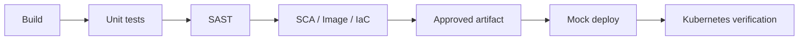

# AppSec / SecOps Case Study

[](https://github.com/naolia1211/appsec-secops-case-study/actions/workflows/ci.yml?query=branch%3Amain)

A security engineering case study demonstrating a gated software
delivery pipeline from source code to a hardened Kubernetes workload.

The repository integrates CI/CD security controls across three layers:

-   **Task 1 - Secure CI/CD:** build, unit testing, SAST, policy
    enforcement and controlled artifact promotion.
-   **Task 2 - Kubernetes Hardening:** least-privilege workload
    configuration, RBAC validation, NetworkPolicy and runtime
    verification.
-   **Task 3 - SCA / Container / IaC Security:** dependency, container
    image and infrastructure-as-code scanning with blocking risk
    policies.

## Delivery flow

The application image is built once and promoted through the pipeline. Security
checks determine whether the artifact can continue to deployment.



Security controls fail closed: a blocking finding, scanner failure,
invalid security evidence, or failed policy evaluation prevents
downstream deployment.

## Quick start

Requires Docker with Linux container support. Run from the repository
root:

``` bash
docker compose up --build -d
curl --fail http://localhost:18080/health
# {"status":"ok"}
```

The API listens on host port `18080`, mapped to container port `8080`.
Stop it with:

``` bash
docker compose down
```

  Endpoint                    Response
  --------------------------- ------------------------------
  `/`                         Service name and version
  `/health`                   `{"status":"ok"}`
  `/api/greeting?name=Linh`   `{"message":"Hello, Linh!"}`

## Full local pipeline with Docker

From Git Bash or a Linux shell, run:

``` bash
bash scripts/demo.sh
```

Docker Compose v2 builds the application and check images, runs tests
and SAST, then starts the application only if the security gate passes.
Python is installed inside the check image; no host Python is required.
The initial run downloads packages and registry rules.

The SAST JSON report is written to `reports/sast/semgrep.json`. The
local application stays available on port `18080` until
`docker compose down`. GitHub Actions uses an ephemeral mock deployment
and removes its container when the job ends.

## Development

Requires Python 3.12. The commands below use Git Bash on Windows:

``` bash
python -m venv .venv
source .venv/Scripts/activate
python -m pip install -r requirements-dev.txt -r requirements-security.txt
python -m pytest -q
python scripts/run_sast.py
```

On Linux, activate the environment with:

``` bash
source .venv/bin/activate
```

In PowerShell, use:

``` powershell
.\.venv\Scripts\Activate.ps1
```

Use `curl.exe` instead of the PowerShell `curl` alias for the HTTP
examples.

## Pipeline

The [workflow](.github/workflows/ci.yml) runs on pushes, pull requests
and manual dispatch. Each downstream stage requires its prerequisite
security and functional checks to succeed.

  -----------------------------------------------------------------------
  Job                                 Check or output
  ----------------------------------- -----------------------------------
  Build                               Build `appsec-demo:<commit SHA>`
                                      and upload the image archive

  Test                                Run API and security-gate unit
                                      tests

  Security                            Scan Python source, evaluate SAST
                                      policy, and publish the approved
                                      image artifact

  Task 3                              Run SCA, container image and IaC
                                      security gates

  Deploy mock                         Load the approved image, start a
                                      container, verify HTTP responses
                                      and collect logs

  Kubernetes hardening                Deploy the approved image to the
                                      local K3s lab and verify runtime
                                      hardening controls
  -----------------------------------------------------------------------

Deploy mock verifies `/health` and `/api/greeting`, including their JSON
contents. Readiness checks have bounded retries, and the container is
removed after the check. This is an ephemeral deployment on the CI
runner, not a persistent public service.

## Security design decisions

A few design choices are intentional:

-   **Build once, promote the same artifact.** Security stages evaluate
    the same application image that is eventually deployed instead of
    rebuilding it later.
-   **Separate detection from policy.** Scanners produce evidence;
    dedicated gates decide whether that evidence is acceptable for
    release.
-   **Fail closed.** Scanner failures, malformed reports and unknown
    security states block downstream deployment rather than silently
    passing.
-   **Verify controls at runtime.** Kubernetes hardening is validated
    against the running workload instead of relying only on static
    manifest inspection.

## Task 1 - SAST and security gate

[`scripts/run_sast.py`](scripts/run_sast.py) scans `app/` and `scripts/`
with the local [rules](.semgrep.yml) and Semgrep's `p/python` ruleset.
The local rules cover dynamic evaluation, shell execution, debug mode
and weak hashes.

[`scripts/security_gate.py`](scripts/security_gate.py) parses
`reports/sast/semgrep.json` and applies this policy:

  -----------------------------------------------------------------------
  Condition               Decision                Exit code
  ----------------------- ----------------------- -----------------------
  One or more ERROR       Block                   1
  findings                                        

  WARNING / INFO only, or Pass; retain findings   0
  no findings             in report               

  Invalid report, scan    Block                   2
  errors, unknown                                 
  severity or no scanned                          
  files                                           
  -----------------------------------------------------------------------

The scanner runs without `--error` so finding policy stays in the gate.
The wrapper also blocks on scanner process failure and removes any old
report before scanning. Severity is supplied by the rule; it is not a
CVSS score.

### Task 1 verification

  ---------------------------------------------------------------------------------------------------------------------------------------
  Case                    Expected result         GitHub Actions
  ----------------------- ----------------------- ---------------------------------------------------------------------------------------
  Clean source            Historical Task 1 jobs  [PASS
                          pass                    run](https://github.com/naolia1211/appsec-secops-case-study/actions/runs/35487648462)

  Intentional eval        Security fails; Deploy  [BLOCK
  fixture                 mock is skipped         run](https://github.com/naolia1211/appsec-secops-case-study/actions/runs/35487650775)
  ---------------------------------------------------------------------------------------------------------------------------------------

The fixture exists only on the demo branch and must not be merged. Both
reports come from actual scans. See [CI evidence](docs/ci-evidence.md)
for commit hashes and [validation](docs/validation.md) for checks
performed.

  -----------------------------------------------------------------------
  Artifact                            Retention
  ----------------------------------- -----------------------------------
  `built-image` - intermediate image  1 day

  `sast-report` - Semgrep JSON, also  30 days
  uploaded on gate failure            

  `approved-image-<SHA>` - image      7 days
  released after gate PASS            

  `deploy-results` - HTTP responses   30 days
  and container logs                  
  -----------------------------------------------------------------------

## Task 2 - Kubernetes hardening

Task 2 uses k3d to run K3s inside Docker and deploys the approved
application image into separate insecure and hardened namespaces.

The hardened workload demonstrates and verifies:

-   non-root execution with a fixed UID;
-   privilege escalation disabled and Linux capabilities dropped;
-   read-only root filesystem and seccomp;
-   CPU and memory requests/limits;
-   dedicated ServiceAccount with no unnecessary Kubernetes API
    permissions;
-   ServiceAccount token automount disabled;
-   default-deny NetworkPolicy with explicit required flows;
-   Restricted Pod Security admission;
-   runtime validation of identity, filesystem, RBAC and network
    controls.

Run the local Kubernetes lab with:

``` bash
bash scripts/demo.sh
docker compose -f docker-compose.k8s.yml build lab
docker compose -f docker-compose.k8s.yml run --rm lab all
```

The CI job `Kubernetes hardening` runs after Deploy mock and downloads
the same approved image artifact rather than rebuilding the application.

See [Task 2](docs/task2.md) for the misconfiguration risks, remediation,
NetworkPolicy rollout strategy, runtime evidence and cleanup commands.

## Task 3 - SCA, container and IaC scanning

Task 3 extends the release gate across three additional security layers:

  -----------------------------------------------------------------------
  Layer                   Tool                    Purpose
  ----------------------- ----------------------- -----------------------
  Dependencies            pip-audit               Detect vulnerable
                                                  Python dependencies

  Container image         Trivy                   Detect OS/package
                                                  vulnerabilities in the
                                                  approved image

  IaC                     Trivy                   Detect insecure
                                                  Dockerfile and
                                                  Kubernetes
                                                  configurations
  -----------------------------------------------------------------------

All scans evaluate the same application artifact and deployment
configuration used by Tasks 1 and 2.

Run the Task 3 checks with:

``` bash
bash scripts/demo.sh
bash scripts/demo_task3.sh
```

Release policy is implemented by
[`sca_gate.py`](scripts/sca_gate.py),
[`container_gate.py`](scripts/container_gate.py), and
[`iac_gate.py`](scripts/iac_gate.py).

See [Task 3](docs/task3.md) for the policy rationale, remediation evidence,
and BLOCK reproduction steps.

### Verified remediation

A historical container scan identified **44 HIGH and 2 UNKNOWN OS
findings** in the previous Debian-based runtime image. Rather than
suppressing the findings or weakening the gate, the runtime image was
remediated and pinned to an Alpine digest.

The remediated image passes SCA, container and IaC gates without risk
exceptions. Local API verification and all 33 Kubernetes runtime checks
also pass.

-   [Historical BLOCK
    run](https://github.com/naolia1211/appsec-secops-case-study/actions/runs/35607540442) -
    Build, Test, SAST and SCA pass; the image gate blocks 46 findings;
    IaC passes; deployment and Kubernetes verification are skipped.
-   [Remediated PASS
    run](https://github.com/naolia1211/appsec-secops-case-study/actions/runs/35608731394) -
    SCA, container and IaC gates pass with no risk exceptions; local API
    and all 33 Kubernetes checks pass.

Task 3 blocks deployment on fixable or HIGH/CRITICAL/UNKNOWN image
findings. No risk exceptions are accepted by default.

See [security exception review](docs/security-exceptions.md) for the
exception model and required review metadata.

## Repository structure

``` text
.github/workflows/     CI/CD security pipeline
app/                   Flask application
docs/                  Task documentation and validation evidence
k8s/                   Kubernetes insecure/hardened manifests
reports/               Generated security reports
scripts/               Security scanners, policy gates and demo automation
tests/                 Application and security-control tests
Dockerfile             Application container image
docker-compose.yml     Local Task 1 environment
docker-compose.k8s.yml Kubernetes lab environment
```

## Scope and limitations

This repository is an interview case study and local security lab, not a
production deployment platform.

-   SAST covers selected source files and rules; dependency and
    container risks are evaluated separately by Task 3.
-   Registry-backed scanner rules require network access and may change
    over time.
-   Transitive dependencies are not fully locked; the application base
    image is pinned by digest.
-   Branch protection is not configured in this public lab. A failed CI
    gate stops downstream deployment but does not independently prevent
    a repository merge.
-   Security exceptions are not accepted by default. The example
    exception workflow demonstrates the required metadata and review
    model; production risk acceptance would require independent approval
    and protected change controls.

See [security exception review](docs/security-exceptions.md) for the
exception model.
